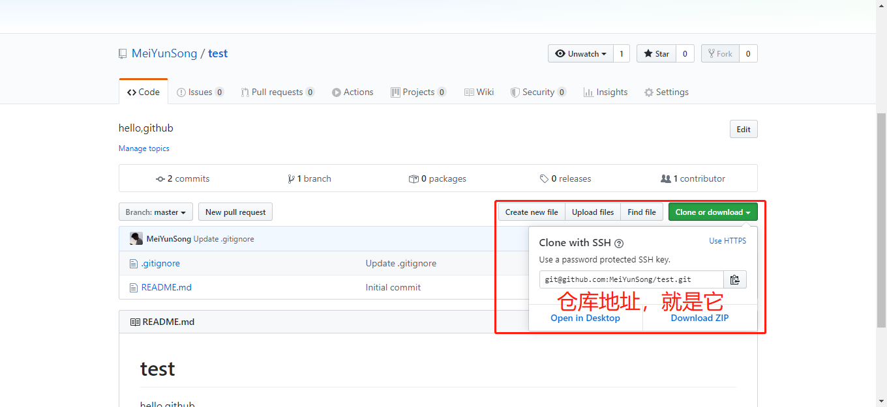
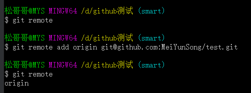
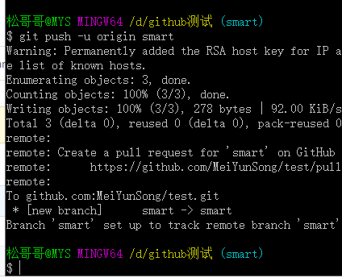
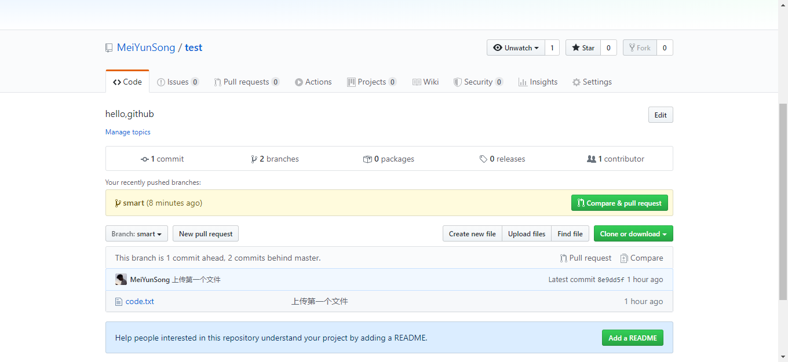

### git本地仓库关联github远程仓库命令如下：

**git remote add origin 你的仓库地址**

去你的github找你的仓库地址，如下图：

**没有ssh用http，有ssh用ssh**。

简单。

**git remote** 查看是否添加成功

 

出现**add** 后面的 **origin**  表示成功关联

如果之前关联过错误的仓库，使用 **git remote rm origin** 即可

### 提示：

​	origin可能是一个仓库名称，并不是固定命令语句，自行把握。

将你的本地仓库代码通过本地分支推送到远程仓库：

git push -u 远程仓库名 本地分支名

例如我的仓库名为：origin

分支名为：smart 

**git push -u origin smart**

然后你的第一个文件就被上传到github仓库了，去仓库看看

以后你可以轻松的下载和上传代码了。